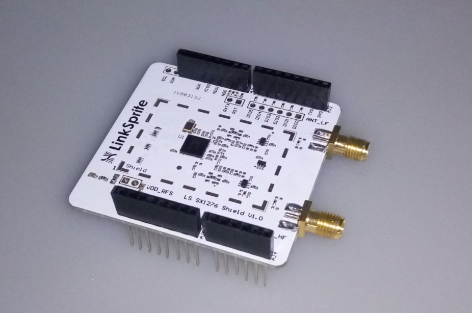
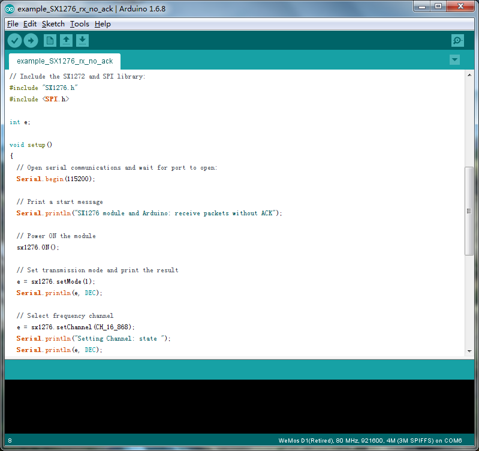
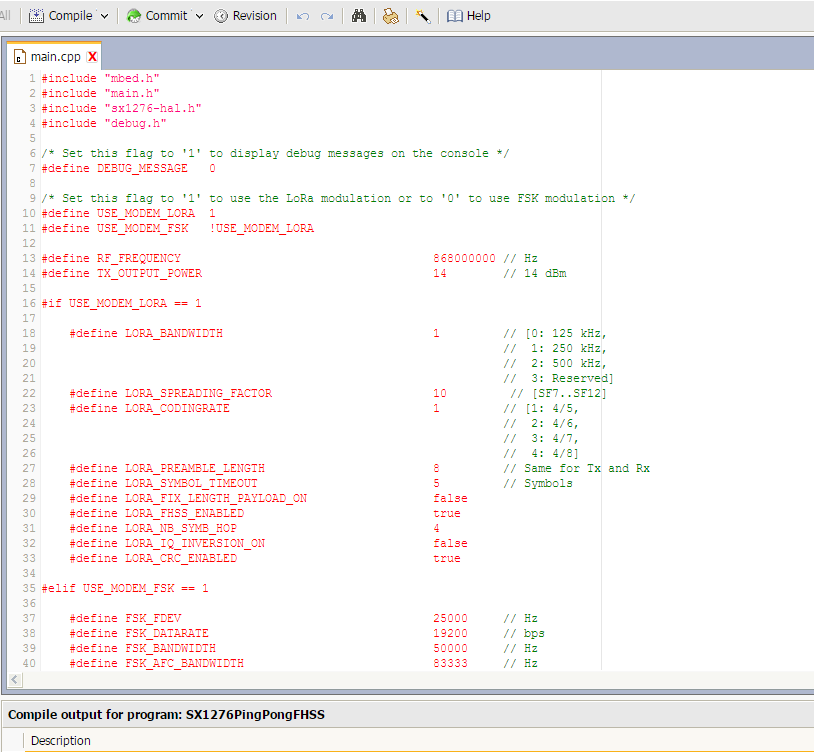

# LS SX1276 Shield



## Introduction

The SX1276 transceivers feature the LoRa® long range modem that provides ultra-long range spread spectrum communication and high interference immunity whilst minimising current consumption.

Using Semtech’s patented LoRa modulation technique SX1276 can achieve a sensitivity of over -148dBm using a low cost crystal and bill of materials. The high sensitivity combined with the integrated +20 dBm power amplifier yields industry leading link budget making it optimal for any application requiring range or robustness. LoRa also provides significant advantages in both blocking and selectivity over conventional modulation techniques, solving the traditional design compromise between range, interference immunity and energy consumption.

## Features

* LoRaTM Modem
* 168 dB maximum link budget
* +20 dBm - 100 mW constant RF output vs. V supply
* +14 dBm high efficiency PA
* Programmable bit rate up to 300 kbps
* High sensitivity: down to -148 dBm
* Bullet-proof front end: IIP3 = -11 dBm
* Excellent blocking immunity
* Low RX current of 9.9 mA, 200 nA register retention
* Fully integrated synthesizer with a resolution of 61 Hz
* FSK, GFSK, MSK, GMSK, LoRaTM and OOK modulation
* Built-in bit synchronizer for clock recovery
* Preamble detection
* 127 dB Dynamic Range RSSI
* Automatic RF Sense and CAD with ultra-fast AFC
* Packet engine up to 256 bytes with CRC
* Built-in temperature sensor and low battery indicator

## Tutorial

#### 1.Arduino code
* Download the arduino [code.](https://github.com/delongqilinksprite/sx1276.git)
* Move the code to arduino-xxxx/libraries/
* Restart the arduino ide
* open the code and upload the code

###### Note: You shuld have two  LS SX1276 Shield,one for client and uploads the ```example_SX1276_tx_no_ack```,another one for server uploads ```example_SX1276_rx_no_ack```



When you complete all of the above steps and then open your serial port, you will be able to see the two LoRa shields start communicating.

#### 2.mBed code

If you already have a mbed account, then you can follow the steps below, otherwise you need to register a mbed account at first.
* Open the page:[https://developer.mbed.org/users/helloqi/code/SX1276PingPong/](https://developer.mbed.org/users/helloqi/code/SX1276PingPong/)
* Import this project on your account
* Select the platform which you have.
* Compile the project and then upload the output file.

###### Note: You shuld have two  LS SX1276 Shield,one for client another one for server.and upload the same code.



When you complete all of the above steps and then open your serial port, you will be able to see the two LoRa shields start communicating.
